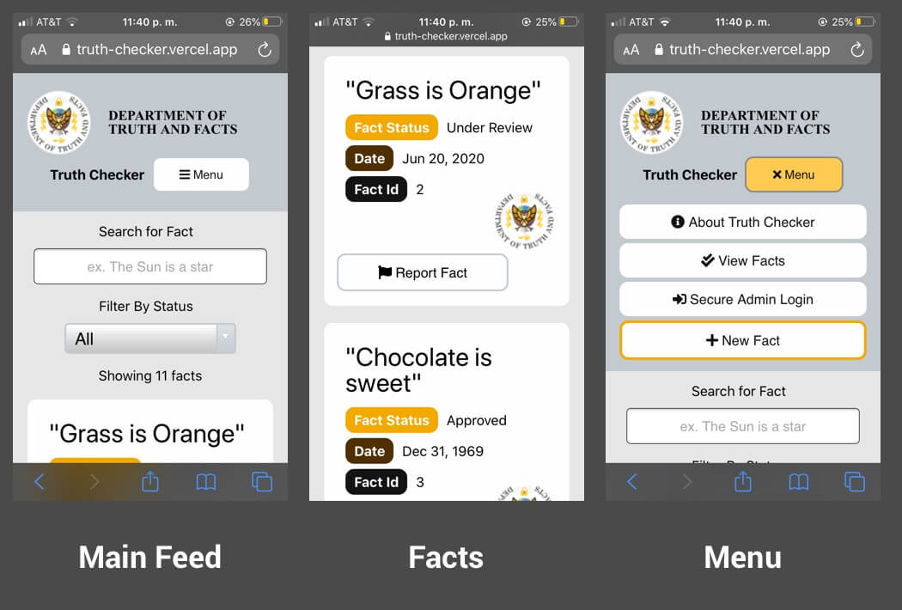
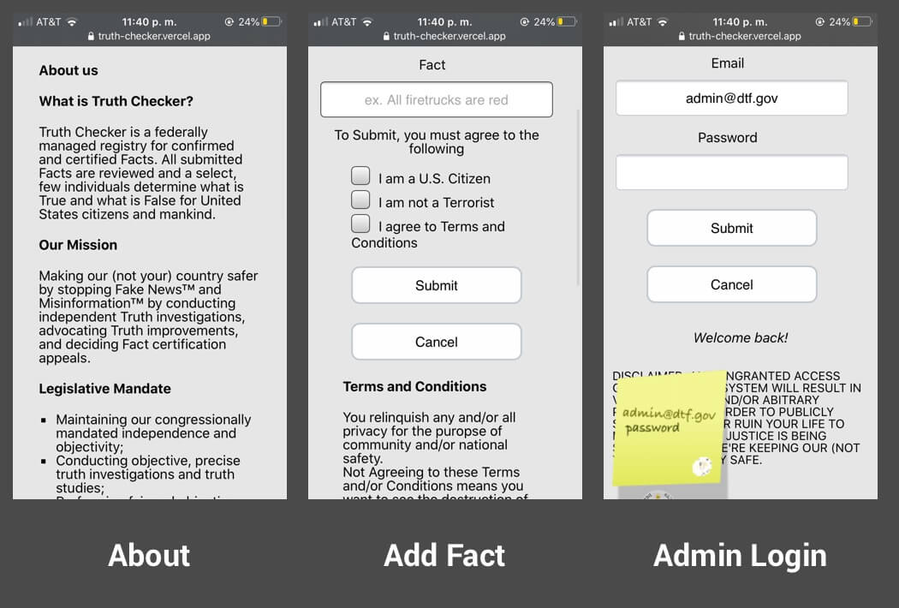
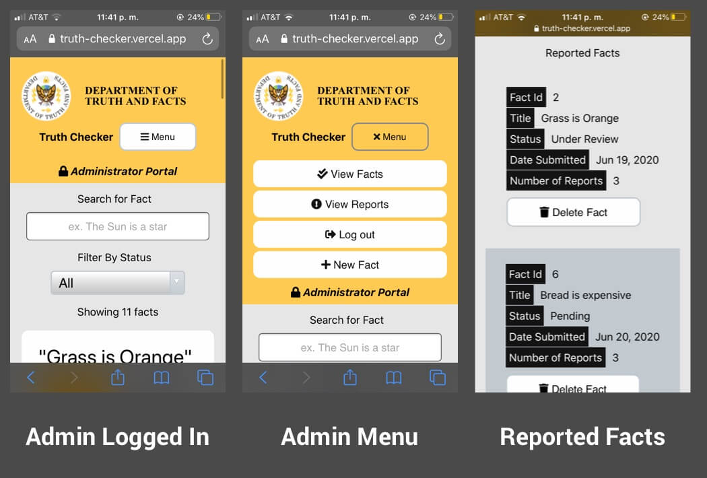

# Truth Checker - a parody database for the truth

## Description
This application is a promotion piece for a music album.
Users can submit facts to be approved by the administrator.
The admin login is purposely left public to allow for users to approved or disapprove their own facts.
The app hopefully highlights the issues with a central place of truth and advocates for First Ammendment Rights
along with finding middle ground rather than seeking to be 'right' about something.

## Live Site
[Truth Checker](https://truth-checker.vercel.app)

## Table of Contents
*  [Technologies](#technologies)
*  [Planning](#planning)
*  [Screenshots](#screenshots)
*  [Requirements](#requirements)
*  [Available Scripts](#available-scripts)

## Technology
- HTML5
- CSS 3
- React (16.13.1)
- Node (13.12.0)
- Express (4.17.1)
- PostgreSQL (12.3)

## Planning
[Wireframes](https://nick-nack-attack.github.io/truth-checker-client/) made in HTML

## Images

## Requirements
- Your app must do something interesting or useful
- Your app must be a full-stack app using React, CSS, Node, Express, and PostgreSQL.
- The client and API should be deployed separately and stored in separate GitHub repos.
- Both client-side and server-side code must be tested.
- At a minimum, you should test the happy path for each endpoint in your API and include a smoke test for each component in your React client. If time permits, include tests for the unhappy paths for each endpoint and add snapshot tests for your client where appropriate.
- Your app must be responsive and work just as well on mobile devices as it does on desktop devices.
- All code must be high quality, error-free, commented as necessary, and clean. When a hiring manager looks at your code, you want them to think, "This person has great coding habits". There should be no errors in the console.
- The styling on your client must be polished. That means choosing fonts and colors that make sense, correctly sizing different components, and ensuring that it looks great on both mobile and desktop devices.
- The content of your app must be clear and readable.
- You must use vanilla CSS for styling capstones. Frameworks like Bootstrap are not permitted. We've found that employers prefer to see candidates who demonstrate a true understanding of CSS.
- You must have comprehensive README files for both GitHub repos (we'll discuss this step in detail at the end of this module).
- Your app must have a landing page that explains what the app does and how to get started, in addition to pages required to deliver the main functionality.
- You must deploy a live, publicly-accessible version of your app.
- Your app must live at a custom URL and include a Favicon (we'll cover this later in the module)
- Your app must work across different browsers (Chrome, Firefox, and Safari at a minimum)
- If you choose to include an authentication system in your app, you must set up a demo user account and indicate on the landing page how to use it.

## Available Scripts

In the project directory, you can run:

### `npm start`

Runs the app in the development mode. 
Open [http://localhost:3000](http://localhost:3000) to view it in the browser.

The page will reload if you make edits. 
You will also see any lint errors in the console.

### `npm test`

Launches the test runner in the interactive watch mode. 
See the section about [running tests](https://facebook.github.io/create-react-app/docs/running-tests) for more information.

### `npm run build`

Builds the app for production to the `build` folder. 
It correctly bundles React in production mode and optimizes the build for the best performance.

The build is minified and the filenames include the hashes. 
Your app is ready to be deployed!

See the section about [deployment](https://facebook.github.io/create-react-app/docs/deployment) for more information.
